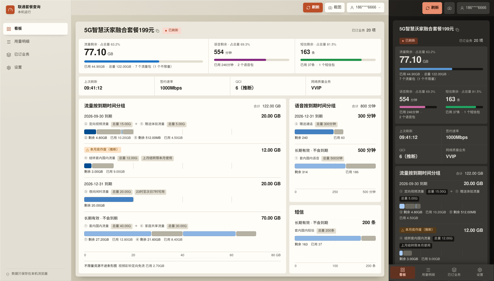
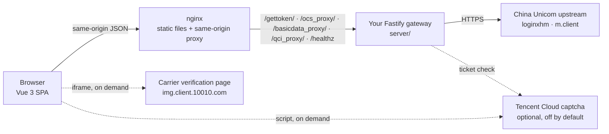

<div align="center">

<a href="README.md"></a>
<a href="README.zh-CN.md"></a>


# Unicom Usage Panel

**A self-hosted China Unicom plan-usage dashboard.**
Data, voice and SMS balances grouped by expiry date, plus contracted rate, QCI and throttling status — a four-section console on a server you run.

[](./LICENSE)
[](package.json)
[](package.json)
[](server/package.json)
[](docker-compose.yml)
[](https://github.com/yatotm/unicomvue/pulls)
[](https://github.com/yatotm/unicomvue/stargazers)

[Quick start](#quick-start) · [Architecture](#architecture) · [Tech stack](#tech-stack) · [Backend notes](server/README.md) · [API & privacy](docs/api-and-privacy.md)



<sub>Fabricated sample data. Every number, package name and phone number in the screenshots is made up — no real account was queried.</sub>

</div>

---

> **This is not an official China Unicom channel.** It reads and displays account information; it never changes an account, a plan or a subscribed service. Query only numbers you own or are explicitly authorized to query, and follow the carrier's terms of service. Plan entitlements, billing and activation status are whatever China Unicom's own systems and official bills say they are — this dashboard is a convenience view, not a source of truth.

## What it is

You log in with your China Unicom number, and the panel shows what is actually left in the plan. A sidebar splits that into four sections, each with its own URL:

| Route | Section | What is on it |
| --- | --- | --- |
| `/` | 看板 | Plan name, connection status and the throttling badge; data, voice and SMS balances with a proportion bar each; last refresh, contracted rate, QCI and network-quality tier as four tiles; data, voice and SMS grouped into expiry lanes |
| `/usage` | 用量明细 | One aligned table per resource kind — name, expiry, remaining, used, total, remaining share — with the plan header and the time of the last refresh above them |
| `/services` | 已订业务 | The services currently active on the line, grouped by kind, with activation dates |
| `/settings` | 设置 | Theme, auto-refresh, accounts, token copying, the privacy notice and build info |

Routes are lazy-loaded and an unknown path redirects to 看板. Multiple accounts can be saved and switched, the view refreshes every 30 seconds, and the top bar's screenshot button captures the current section's card without a screen recorder.

Everything the app keeps lives in your browser's `localStorage`. The server persists nothing.

<details>
<summary><b>More screenshots</b> — the other three routes, the dark theme, the phone layout, login</summary>

<table>
  <tr>
    <td width="50%" align="center">
      <br>
      <sub>看板 · light</sub>
    </td>
    <td width="50%" align="center">
      <br>
      <sub>看板 · dark</sub>
    </td>
  </tr>
  <tr>
    <td width="50%" align="center">
      <br>
      <sub>用量明细</sub>
    </td>
    <td width="50%" align="center">
      <br>
      <sub>已订业务</sub>
    </td>
  </tr>
  <tr>
    <td width="50%" align="center">
      <br>
      <sub>设置 — note the disabled screenshot button</sub>
    </td>
    <td width="50%" align="center">
      <br>
      <sub>Login dialog</sub>
    </td>
  </tr>
  <tr>
    <td width="50%" align="center">
      <br>
      <sub>Phone layout · 390&nbsp;px wide</sub>
    </td>
    <td width="50%" align="center"></td>
  </tr>
</table>

All values shown are fabricated sample data.

</details>

## Why run it yourself

A phone number, an SMS code and a carrier session token are the keys to a mobile account. This panel is built so that they only ever move between three parties: your browser, a gateway you operate, and China Unicom. There is no third-party API in the path, and no build flag that quietly puts one there.

| Concern | How this project handles it |
| --- | --- |
| Backend | [`server/`](server/README.md) — a Fastify 5 gateway you run yourself, and the only process that opens a connection to `10010.com` |
| Credential path | Browser → your gateway → China Unicom. Nothing in between. |
| Login | SMS code, Unicom account password, or a raw `ecs_token`; the carrier's own in-page verification is handled inline when the carrier asks for it |
| Query auth | A full carrier cookie session kept per account — which is what the balance endpoint actually requires |
| Extra captcha | Off by default. When enabled it uses *your* Tencent Cloud app credentials, handed to the browser at runtime instead of being baked into the bundle |
| Persistence | Browser `localStorage` only. Server-side there is no database and no file: rate-limit counters and pending retries live in process memory |
| Deployment | Docker Compose (nginx + API), a static build behind your own proxy, or standalone containers |

## Highlights

- **Self-hosted end to end.** Browser → your Fastify gateway → `10010.com`. No third-party API is ever in the path.
- **Nothing persisted server-side.** Rate-limit counters and pending-retry state live in process memory and vanish on restart. No database, no files.
- **Buckets grouped by when they expire.** The carrier hands back several packs with the same name; the panel sorts them into one lane per expiry date, nearest first, so “which 30 GB runs out at the end of the month” has an answer.
- **Three login modes.** SMS code, Unicom account password, or a raw `ecs_token` — with the carrier's official in-page verification handled inline when it is required.
- **QCI you can reason about.** The gateway reports only what the carrier returned; the browser derives the level from the active 5G network-quality subscription (VVIP → 6, VIP → 8, subscribed to neither → 9) and labels the result `（推断）`. An explicit QCI number from the carrier always wins.
- **Charts that cannot invent history.** Nothing is persisted, so nothing can be plotted against time. Every chart is proportion or comparison only — hand-rolled in CSS, with no charting library and no new dependency.
- **Sub-card data never leaves the gateway.** The balance payload and the subscribed-service list are each rebuilt field by field from an explicit whitelist, so `viceCardlist`, `userMobile`, `usernumber` and `username` are dropped before the response is written.
- **One command to deploy.** `docker compose up -d` brings up nginx plus the API with a healthcheck gate and log rotation.
- **Logs you can paste into an issue.** Request ID, route, HTTP status, carrier business code and response *shape* — never bodies, tokens, cookies or phone numbers.

<details>
<summary><b>Full feature list</b> — login, the four sections, accounts, UI, backend</summary>

**Login**

- SMS verification code, with a 60-second resend cooldown
- Unicom account password (8–20 characters, case and symbols preserved) — encrypted by the gateway before it goes upstream, never written to the account list or the logs
- The carrier's official verification page, embedded and origin-checked, for the `ECS99999` / `ECS99998` challenge branch
- Direct `ecs_token` entry for accounts obtained elsewhere
- Optional Tencent Cloud captcha in front of the SMS endpoint, off by default
- A bottom sheet on phones, a centred dialog from `sm:` up

**看板** (`/`)

- The plan name is the card's own heading; tap it to copy `onlin_token`, long-press for `ecs_token`. Connection status and the active-service count sit on the same line
- Throttling detected by its own service ID `50027` and surfaced as a badge in that line
- Data, voice and SMS each get a balance figure, the share of the total it represents, and one proportion bar. The section with a denominator goes first and owns the screen's single 34px figure
- Where remaining and used do not add up to the total the carrier reported, the percentage and the bar are withheld and the row says so — the figures are still printed, because those are what the carrier returned
- Last refresh, contracted rate, QCI and network-quality tier as four fact tiles, each carrying its reasoning in a tooltip
- Data, voice and SMS grouped into expiry lanes: one lane per expiry date, ordered by urgency, bars drawn on a shared absolute scale
- Carried-over packs are flagged `本月底作废（推断）`, an inference labelled as one
- Unmetered packs have no denominator, so they stay out of the bars and are reported as a footnote with their absolute used figure

**用量明细** (`/usage`)

- The plan name, connection status, the throttling badge and the time of the last refresh in one header line
- One aligned table per resource kind — data, voice, SMS — with columns for name, expiry, remaining, used, total and remaining share, folding into stacked lines per row on phones
- Packs are numbered ①②③ so two packs with the same name stay distinguishable; when the carrier returns several identically named entries, the numbering rule is printed under the table
- Only exceptions are tagged: 专属 / 其他 / unknown flow type, 无限量, and — on unmetered packs only — whether they are shared. 通用 and 有上限 are the default and are not printed on every row
- An unmetered row shows `不限量` instead of a percentage and an indeterminate sweeping bar instead of a filled one
- Empty states distinguish “the carrier returned zero records” from “the carrier did not return this group at all”

**已订业务** (`/services`)

- Every service currently active on the line with its activation date, grouped by kind (network and rate, voice, SMS, call features, value-added, international and roaming) plus an 其他业务 catch-all, so a service with an unrecognised ID is never dropped
- Grouping keys on the service ID first and falls back to keywords in the service name; groups are ordered by size, with the catch-all last
- The active count and the network-quality tier are printed above the groups; an empty list and a list the carrier never returned are two different empty states, with different wording

**设置** (`/settings`)

- Light, dark and follow-system themes
- Auto-refresh every 30 seconds, pausable, plus manual refresh and the timestamp of the last successful query
- Account list with switch, add and remove
- Buttons to copy `onlin_token` and `ecs_token`
- Privacy notice, repository and feedback links, build branch, commit and build time
- The screenshot button is disabled here — this section holds controls, not shareable data

**Accounts**

- Save, switch and remove multiple accounts
- Per-account carrier cookie session, submitted with every query
- A failed query never silently deletes an account; a re-login prompt fires once per credential and stops retrying

**UI**

- A console shell: a 264px sidebar of four `RouterLink`s marking the current route with `aria-current="page"`, and a sticky top bar. From `lg:` up the shell is locked to one screen height and the main region owns the scroll; below that the document scrolls and the top bar fades in its surface, hairline and blur over the first 160px
- **The top bar carries controls only** — refresh, screenshot, account — and no page title. Each route sets `document.title` and a visually-hidden `<h1>`, so the page still has a name and a heading outline
- **Phones navigate with a bottom tab bar**, not a hamburger drawer: four destinations fit, so all four are one tap away and there is no dialog to trap focus in
- One primary action in the top bar. Refresh is the only filled button; screenshot and the account menu are quiet icon buttons. Theme, pause, add/remove account, privacy and build info all live in 设置
- One card per route, identical on all four: same top, same left, same width, stretched to the full height of the main region. Inside it, every region is a nested 6px card on paper stock — grouping comes from surface and spacing, not from a border around each box
- Sibling regions in a row share a bottom edge. A region that would overflow scrolls inside itself instead of making the row taller, and announces that it is scrolling with a shading gradient, a tab stop and a Chinese `aria-label`
- A warm neutral surface ladder — canvas, tray, panel, sunken — with a terracotta accent that is reserved for brand and controls. Data colours are separate: an ordinal blue ramp for expiry urgency and a fixed three-slot categorical set for data / voice / SMS, neither of which touches the red / amber / green the status scale owns
- Closed sets everywhere: five type steps (12 / 14 / 17 / 22 / 34), two font weights, ten text colours, four radii. Design tokens live in `src/assets/base.css` and are mapped to Tailwind colour names in `src/assets/main.css`; no `.vue` file may write a raw colour value
- [`docs/ui-guidelines.md`](docs/ui-guidelines.md) is the contract every `.vue` file follows, and `tests/uiContract.test.js` asserts the measurable parts of it in a real DOM — contrast at the worst point of the canvas gradient, the step between any two adjacent surfaces, the type and weight sets, the router shape, the tab bar, the absence of a title in the top bar, the 44px touch floor and the reduced-motion rule
- One shared dismissal primitive (`useDismissable`) backs every overlay: outside pointerdown, Escape on the document's capture phase, focus leaving the panel, and a route change — plus focus returned to the trigger
- Chart geometry transitions only when the data changes and never loops; under `prefers-reduced-motion: reduce` it drops to 1ms and the two sweeping animations (skeleton, unmetered bar) stop
- In-app privacy modal rendered from `docs/api-and-privacy.md`, so the docs and the UI cannot drift apart

**Backend**

- Per-phone and per-IP hourly limits on SMS, login and captcha verification
- Same-origin-only by default; extra browser origins are opt-in via `ALLOWED_ORIGINS`
- Optional shared `ACCESS_TOKEN` for the API, compared in constant time
- 16 KiB request-body cap, 2 MiB upstream response cap, 30-second request timeout, `no-store` and `nosniff` on every response
- Dedicated HTTP/HTTPS agents that explicitly ignore `HTTP_PROXY` / `HTTPS_PROXY`
- Credential-bearing requests never follow redirects
- `X-Request-ID` correlates the `api.response` and `unicom.response` log lines for one request

</details>

<details>
<summary><b>Status and known limits</b> — what has been verified against a real line</summary>

Verified with a real account: password login, the carrier's official in-page verification, balance queries under full cookie auth (including sustained auto-refresh), the basic-data rate endpoint and the subscribed-service endpoint.

Not yet verified end to end: SMS send and SMS login. Direct probes of `/mobileService/sendRadomNum.htm` and `/mobileService/radomLogin.htm` return HTTP 200 with number-validation errors, which proves reachability but not a delivered message.

Other limits worth knowing:

- `ECS1500 / type=4` is face verification. The carrier's page calls native `faceV3Detect` capabilities that a browser cannot execute, so the UI says so plainly instead of silently downgrading to a weaker check.
- The rate on screen is the highest of three *contracted* values the carrier reports — the plan's signed rate, the ordered-service rate ceiling and the downlink peaks written into service names. None of them is a speed test, and none of them participates in the QCI decision.
- A service counts as active only when the carrier's `servicestate` says so: the numeric `"1"`, or — for response shapes that report text instead — a Chinese status that is not one of the retired / expired / not-yet-effective ones. A cancelled network-quality subscription therefore no longer inflates the QCI.
- QCI is inferred from the subscribed-service list unless the carrier returns an explicit number; inferred values carry the `（推断）` label. With no service list at all the field reads `未确认`, and a failed request leaves it at `—`.
- `本月底作废（推断）` is inferred too, from the phrase `上月结转限本月使用` inside the resource name — the carrier returns no field for it. Reword that phrase upstream and the pack falls back to plain expiry-date grouping; the panel never pretends to know.
- Rate limiting is per-process and in-memory. It is not suitable for sharing across replicas.
- Behaviour varies by account and by province. Carrier field names can change; `normalize.js` and the `UNICOM_*_PATH` variables are the adjustment points.

</details>

## Charts

The app polls the current balance and stores nothing. There is no history to plot, so **there is no trend chart anywhere in it** — a time axis would have to be invented. Every chart answers a proportion or comparison question about the figures the carrier returned for this one refresh:

| Chart | Form | Question it answers |
| --- | --- | --- |
| Expiry lanes ([`ExpiryLanes.vue`](src/components/ExpiryLanes.vue)) | One lane per expiry date; bar length is the absolute allowance, on a shared ruler that starts at 0 | What expires when, and how much of it is still there |
| Overview bars ([`DashboardHero.vue`](src/components/DashboardHero.vue)) | One 8px bar per resource kind | How much of data, voice, SMS is left against its own limit |
| Remaining-share bars ([`ResourceTable.vue`](src/components/ResourceTable.vue)) | One bar per row | Which pack is nearly gone |

Lanes are ordered by urgency: this month (including the inferred carried-over pack) → a dated expiry, soonest first → long-lived → expiry unknown. The upper bound of the shared ruler is snapped to a number a human reads — 80 GB, 500 minutes — never 78.13 GB. Within a lane, each pack is drawn as a remaining segment in the expiry colour followed by a used segment in a neutral grey, and every segment gets a printed figure next to it, so no reading depends on matching a colour by eye.

Four correctness properties are visible on screen rather than papered over:

- **An unmetered bucket has no denominator**, so it is excluded from every proportion chart. On 看板 it becomes a footnote carrying the absolute used figure; in 用量明细 it gets an indeterminate sweeping bar and the word `不限量` instead of a percentage.
- **A row whose ratio the carrier did not report draws no bar.** An empty track is the honest rendering; the percentage cell reads `—`.
- **Remaining + used ≠ total is never smoothed over.** The bar is clamped so it cannot run past the ruler, the percentage is dropped rather than computed from the clamp, and a line under the lane names the packs that do not reconcile.
- **An inferred conclusion is labelled as inferred and carries its reasoning** — `6（推断）`, `本月底作废（推断）` — in a tooltip that states what it was derived from.

A separate 本月消耗去向 dot plot existed briefly and was removed as redundant: every lane already draws a used segment and prints its own used figure, so the dot plot restated the same numbers a second way on the same screen.

All of it is hand-rolled: flex and absolute positioning for the lanes, CSS widths for the bars. **No charting library, and zero new dependencies.** The chart palettes live in the same token layer as the rest of the UI, so a chart cannot pick colours a theme has not defined.

## Architecture



The SPA never talks to a carrier endpoint directly. It calls same-origin paths; nginx (in production) or the Vite dev proxy (locally) forwards them to the gateway, and only the gateway holds a connection to `10010.com`. The two dashed edges are the exceptions: the carrier's own verification page is embedded in an iframe whose origin and path are validated on both sides, and the Tencent captcha script is fetched only when captcha is enabled and the carrier asks for it.

## Quick start

```bash
git clone https://github.com/yatotm/unicomvue.git
cd unicomvue

corepack enable
pnpm install --frozen-lockfile

cp .env.example .env
cp server/.env.example server/.env

pnpm run build                  # the web image copies a prebuilt dist/
docker compose up -d --build
```

Open <http://localhost:8086>.

Only the web port is published; the API stays on the Compose network at `api:8788`. Set `WEB_PORT` in the root `.env` to move it, and `WEB_HOST=0.0.0.0` if you need LAN access. Requires Docker Compose 2.24+.

<details>
<summary><b>Local development</b> — requirements, commands, ports</summary>

**Requirements**

- Node.js `^20.19.0` or `>=22.12.0`
- pnpm `10.30.3` — let Corepack pin it:

```bash
corepack enable
corepack prepare pnpm@10.30.3 --activate
```

**Run**

```bash
pnpm install --frozen-lockfile
cp .env.example .env
cp server/.env.example server/.env
pnpm dev
```

`pnpm dev` starts both halves: the SPA on <http://localhost:5173> and the API on `127.0.0.1:8788`. `pnpm dev:web` and `pnpm dev:api` start them individually — use `dev:web` alone when pointing at a gateway that already runs somewhere else.

Leave `VITE_API_BASE_URL` empty. The Vite dev and preview proxies read `HOST` and `PORT` straight out of `server/.env`, so changing the backend port needs no second edit; `VITE_DEV_API_TARGET` overrides the target when you want something else. The dev port is strict — a collision is a hard error, never a silent reassignment.

**Check and build**

```bash
pnpm run lint          # oxlint, then eslint
pnpm run lint:fix
pnpm test              # frontend + server suites
pnpm run build         # → dist/
pnpm preview
```

`pnpm preview` serves the built SPA only; the API still has to be running.

</details>

<details>
<summary><b>Deployment</b> — Compose, static build, standalone Docker, CI</summary>

### Docker Compose (recommended)

The stack is two services. `api` builds from `server/Dockerfile` (Node 22 alpine, production dependencies only, non-root) and is reachable inside the network as `api:8788`. `web` is nginx serving `dist/` with [`deploy/nginx.conf`](deploy/nginx.conf) mounted read-only, and it only starts once the API healthcheck passes.

Compose overrides `HOST`, `PORT` and `TRUST_PROXY` for the API container, so a backend port already in use on the host is irrelevant. `server/.env` is optional (`required: false`) — without it the gateway boots on its defaults. API logs rotate at 3 × 10 MiB.

```bash
pnpm run build
docker compose up -d --build

docker compose logs --since 10m --timestamps api
docker compose up -d --no-deps web        # after editing WEB_HOST / WEB_PORT
```

nginx reverse-proxies exactly five paths — `/gettoken/`, the three `*_proxy/` endpoints and `/healthz` — and resolves the `api` service name dynamically at `127.0.0.11`, so rebuilding the API container does not strand the proxy on a stale IP. Everything else hits `try_files $uri $uri/ /index.html`, so `/usage`, `/services` and `/settings` survive a reload or a pasted link instead of 404ing. The server block also caps request bodies at 16k and sends `Referrer-Policy: no-referrer`.

### Static files

Run `pnpm run build` and deploy `dist/` behind a web server that proxies the same five API paths to a gateway, or set `VITE_API_BASE_URL` to your gateway's URL and rebuild. Because the router uses real URLs rather than hash anchors, that server also has to rewrite unmatched paths to `index.html` — [`deploy/nginx.conf`](deploy/nginx.conf) is the reference. **Static files alone give you no API** — the bundle has no fallback host to call.

### Standalone Docker

The root `Dockerfile` is an nginx image that copies an already-built `dist/`; it does not build the SPA itself.

```bash
pnpm install --frozen-lockfile
pnpm run build
docker build -t unicom-panel:local .
```

### Public deployment

Terminate HTTPS in front of both the page and the API, and put real access control there — VPN, reverse-proxy auth, whatever fits. `VITE_API_ACCESS_TOKEN` is compiled into public JavaScript and is not a site password. If TLS terminates at an outer proxy, list the public HTTPS origin in `ALLOWED_ORIGINS`.

### CI

[`.github/workflows/docker-publish.yml`](.github/workflows/docker-publish.yml) runs on pushes to `main`, on `v*` tags and on demand: lint, test, build, publish `dist.zip` to the `gh-pages` branch, then push a multi-arch (`linux/amd64`, `linux/arm64`) image of the root `Dockerfile` to Docker Hub. It needs `DOCKER_USERNAME` and `DOCKER_PASSWORD` repository secrets; without them the publish step cannot run.

</details>

<details>
<summary><b>Configuration</b> — every environment variable</summary>

Two files, both optional, both with a `.env.example` next to them. The gateway always reads `server/.env` relative to the repo, never the working directory, and real environment variables win over the file. Restart after editing.

### Root `.env` — build and Compose

| Variable | Default | Description |
| --- | --- | --- |
| `VITE_API_BASE_URL` | empty | Gateway base URL baked into the bundle. Empty means same-origin, which is what you want with nginx or the dev proxy in front. |
| `VITE_API_ACCESS_TOKEN` | empty | Must match the gateway's `ACCESS_TOKEN`. Visible in the shipped JavaScript — not a password. |
| `VITE_CAPTCHA_APP_ID` | empty | Only needed when pointing at a third-party compatible backend. The bundled gateway returns its own AppID at runtime. |
| `VITE_DEV_API_TARGET` | empty | Overrides the dev/preview proxy target. Empty means "read `HOST` and `PORT` from `server/.env`". |
| `WEB_HOST` | `127.0.0.1` | Interface Compose binds the web port to. `0.0.0.0` for LAN access. |
| `WEB_PORT` | `8086` | Published web port. The API is not published at all. |

### `server/.env` — gateway

| Variable | Default | Description |
| --- | --- | --- |
| `HOST` | `127.0.0.1` | Listen address. Compose overrides it to `0.0.0.0`. |
| `PORT` | `8788` | Listen port. Compose overrides it to `8788` inside the container. |
| `ALLOWED_ORIGINS` | empty | Comma-separated extra browser origins. Empty means same-origin only. Must be bare `http(s)` origins — no path, query or credentials. |
| `TRUST_PROXY` | empty | Trusted proxy IP/CIDR list or hop count. `true` is rejected outright. Compose sets `1`. |
| `ACCESS_TOKEN` | empty | Optional shared secret, submitted as `access_token` in the request body. |
| `DEBUG_RAW` | `false` | Returns raw upstream payloads under `_raw`. Diagnostics only — they can contain a full phone number and credentials. |

**Upstream**

| Variable | Default | Description |
| --- | --- | --- |
| `UNICOM_BASE_URL` | `https://m.client.10010.com` | Query origin. |
| `UNICOM_LOGIN_BASE_URL` | `https://loginxhm.10010.com` | Login and SMS origin. |
| `UNICOM_APP_VERSION` | `android@13.0000` | Client version string sent upstream. |
| `UNICOM_APP_ID` | `ChinaunicomMobileBusiness` | Client app identifier. |
| `UNICOM_TIMEOUT_MS` | `15000` | Covers connect, response headers and the full body. |
| `UNICOM_SEND_SMS_PATH` | `/mobileService/sendRadomNum.htm` | Must resolve under `UNICOM_BASE_URL`. |
| `UNICOM_LOGIN_PATH` | `/mobileService/radomLogin.htm` | SMS login. |
| `UNICOM_PASSWORD_LOGIN_PATH` | `/mobileService/login.htm` | Password login — not a substitute for the SMS path. |
| `UNICOM_OCS_PATH` | `/servicequerybusiness/operationservice/queryOcsPackageFlowLeftContentRevisedInJune` | Plan and balances. |
| `UNICOM_BASIC_DATA_PATH` | `/servicebusiness/query/fiveg/getbasicdata` | Masked number, contracted rate. |
| `UNICOM_QCI_PATH` | `/servicebusiness/newOrdered/queryOrderRelationship` | Subscribed services. |

**Rate limits** (per hour, fixed window, in-memory)

| Variable | Default |
| --- | --- |
| `SMS_LIMIT_PER_PHONE_HOUR` | `5` |
| `SMS_LIMIT_PER_IP_HOUR` | `10` |
| `LOGIN_LIMIT_PER_PHONE_HOUR` | `20` |
| `LOGIN_LIMIT_PER_IP_HOUR` | `60` |
| `CAPTCHA_LIMIT_PER_IP_HOUR` | `60` |

**Captcha** — an *extra* gate in front of the SMS endpoint, independent of the carrier's own verification. The carrier's official verification page does not need it.

| Variable | Default | Description |
| --- | --- | --- |
| `CAPTCHA_ENABLED` | `false` | Enabling it without both credentials below aborts startup. |
| `CAPTCHA_APP_ID` | empty | Your own Tencent Cloud captcha app. Returned to the browser in the `need_captcha` response, so no rebuild is needed. |
| `CAPTCHA_APP_SECRET` | empty | Stays server-side. |
| `CAPTCHA_TIMEOUT_MS` | `10000` | Ticket verification timeout. |

A verified ticket is bound to the phone number and client IP, is single-use, and expires after five minutes (`CAPTCHA_TTL_MS`).

A few more knobs are read by [`server/src/config.js`](server/src/config.js) but left out of `.env.example` because the defaults are almost always right: `LOG_LEVEL` (pino level, default `info`), `UNICOM_ECS_ACC`, `UNICOM_DEVICE_BRAND`, `UNICOM_DEVICE_MODEL`, `UNICOM_ANDROID_VERSION` and `CAPTCHA_TTL_MS`. Every value is validated at boot; a bad one throws instead of being silently coerced.

</details>

<details>
<summary><b>API</b> — endpoints the browser calls</summary>

All request bodies are JSON objects, capped at 16 KiB. The SPA sends `Content-Type: text/plain;charset=UTF-8`, and `application/json` is accepted too. Every response is `no-store`.

| Method | Path | Purpose |
| --- | --- | --- |
| `POST` | `/gettoken/?action=send` | Request an SMS code; may return a verification challenge |
| `POST` | `/gettoken/?action=validate` | Verify a Tencent captcha ticket, issue a `resultToken` |
| `POST` | `/gettoken/?action=login` | Phone number + SMS code → token and cookie session |
| `POST` | `/gettoken/?action=password` | Phone number + Unicom account password |
| `POST` | `/ocs_proxy/` | Plan and resource balances, rebuilt from a field whitelist |
| `POST` | `/basicdata_proxy/` | Masked number, contracted rate, LTE status |
| `POST` | `/qci_proxy/` | Subscribed services: network-quality levels, service-list presence, throttling flag, the carrier's rate ceiling, the whitelisted list of active services, and an explicit QCI if the carrier sent one |

Field-level details, the exact data flow, what lands in `localStorage`, clipboard and screenshot behaviour, and the full service disclaimer are in [docs/api-and-privacy.md](docs/api-and-privacy.md) — the same file the in-app privacy modal renders. Gateway internals, verification notes and troubleshooting are in [server/README.md](server/README.md).

`GET /healthz` answers `{"ok":true}` for the Compose healthcheck.

**Privacy in one paragraph.** Phone numbers, SMS codes, passwords and tokens are used only to complete the login and query you asked for. The gateway keeps nothing on disk: rate-limit counters, short-lived verification results and pending-retry payloads live in memory and are gone on restart. Normal logs contain no phone number, password, code, token, cookie value or raw upstream payload. Tokens, cookies and account metadata are stored in your browser's `localStorage`; removing an account deletes its credentials there, while auxiliary keys such as the device identifier remain until you clear the site's storage.

</details>

<details>
<summary><b>FAQ</b></summary>

**I used to see fewer data packs than my plan has.**

Fixed. The browser deduplicated the carrier's resource blocks on `feePolicyId`, which identifies a *tariff policy* rather than a bucket. One plan derives several blocks from the same policy — the in-plan allowance, the carried-over allowance, bundled extras — so everything after the first collapsed into it and silently disappeared. A bucket's identity is now the tariff policy *plus* its own name, total, expiry, flow type and billing unit (`detailKey` in [`src/domain/usage.js`](src/domain/usage.js)), and `tests/usageBuckets.test.js` covers it. If you remember a pack that was on your bill but not on this screen, that was this.

**Can I deploy only the frontend?**

No. The bundle has no third-party gateway to fall back on, so static files answer no API call — either run `server/` yourself or point `VITE_API_BASE_URL` at a gateway you control.

**Frontend and backend on different origins?**

Set `ALLOWED_ORIGINS=https://your-frontend-domain` in `server/.env`. Same-origin deployments leave it empty. Note that a command-line client sends no `Origin` header at all, so this is a browser guardrail, not authentication.

**Is `VITE_API_ACCESS_TOKEN` a password?**

No. Anything prefixed `VITE_` is compiled into public JavaScript. Restrict access with a VPN or reverse-proxy auth in front of both the page and the API.

**Where does the QCI number come from?**

From the subscribed-service list. An active *5G 网络服务质量 VVIP* subscription maps to QCI 6, an active *VIP* to QCI 8, and a service list that contains neither to 9, the 3GPP default bearer. Values reached that way are labelled `（推断）` in the UI, for example `8（推断）`. If the carrier returns an explicit QCI number, that number is used verbatim and carries no label. With no service list at all the field reads `未确认`; if the request itself fails it stays `—`.

The gateway does not infer anything — it reports `network_quality_services`, a `has_service_list` boolean, the throttling flag, the rate ceiling `max_net_mbps` and a whitelisted `services` list, and the browser does the mapping. Only services the carrier marks as active are counted, so a cancelled *VVIP* subscription cannot keep producing QCI 6. Bandwidth ceilings and QoS class remain formally distinct parameters, which is exactly why an inferred value is marked as inferred: a 2000Mbps contracted downlink can still be QCI 8, and a rate parsed out of a service name changes the rate on screen and nothing else.

**Why is one of my packs flagged `本月底作废（推断）`?**

Because its name contains `上月结转限本月使用` — carried over from last month, usable only until this month ends. The carrier returns no field saying so, and the `endDate` it does return is often `长期有效`, which would file the pack under “never expires”. The panel infers the end of the current month instead, and labels the inference. If the carrier rewords that phrase, the pack quietly falls back to plain expiry-date grouping rather than guessing.

**What of the subscribed-service list actually reaches the browser?**

An explicit whitelist rebuilds each entry from three fields — `id`, `name` and `since`, the activation date as `YYYY-MM-DD` — plus `downlink_mbps` when, and only when, a downlink rate can be parsed out of the service name. The carrier's own entry carries twelve fields; the identifying ones — `usernumber` (the phone number), `username` (the subscriber's name) and the package/product names — never leave the gateway. The list is capped at 100 entries and each name at 60 characters. `server/test/normalize.test.js` asserts that none of the withheld values appears in the response.

The balance payload is filtered the same way: resource groups and their details are rebuilt from a fixed field list and only scalars are allowed through, so the sub-card array `viceCardlist` — including its `usernumber` and the encrypted `userMobile` — and the account-bearing redirect URLs are dropped at the gateway. See [docs/api-and-privacy.md](docs/api-and-privacy.md) for the exact whitelists.

**The page says I need the official app.**

That is `ECS1500 / type=4`, face verification. The carrier's page invokes native capabilities a browser cannot run. Try password login, or complete the check in the official app.

**Where is my data stored?**

In your browser's `localStorage`, on the device you used. Nothing is written server-side. Copying a token puts the full value on the system clipboard, where clipboard history and other apps may retain it.

**`docker compose up` fails while building the `web` image.**

The web image copies an existing `dist/`, and `dist/` is gitignored. Run `pnpm run build` first.

**Can I request a feature?**

Open an [issue](https://github.com/yatotm/unicomvue/issues) with the scenario, the expected behaviour and why it matters.

</details>

<details>
<summary><b>Project structure</b></summary>

```
.
├── src/                      Vue 3 SPA
│   ├── assets/               design tokens (base.css) and the Tailwind theme (main.css)
│   ├── router/               four routes under one layout, lazy-loaded, unknown paths redirect
│   ├── views/                AppLayout (the shell) + DashboardView, UsageView,
│   │                         ServicesView, SettingsView
│   ├── components/           sidebar, top bar, bottom tab bar; the page card, its panels,
│   │                         expiry lanes, resource tables, service groups, chips and
│   │                         empty notes; login dialog, account menu, privacy modal, toast
│   ├── composables/          login flow, accounts, theme, screenshot, carrier verification,
│   │                         toast, privacy, overlay dismissal, scroll lock, header surface
│   ├── domain/               account, usage and subscribed-service normalization (pure functions)
│   ├── utils/                usageBuckets.js (the expiry-grouped display model), usageNames.js,
│   │                         chartScale.js, navigation.js, paneOverflow.js, dashboardContext.js
│   ├── services/             HTTP client, localStorage access
│   └── config/               API endpoints, storage keys, refresh interval, captcha script
├── server/                   Fastify gateway (pnpm workspace package)
│   ├── src/routes/           /gettoken/ and the three query proxies
│   ├── src/upstream/         carrier client, cookies, credentials, normalize, verification,
│   │                         diagnostics
│   ├── scripts/              probe, network-check, live-check
│   └── test/                 node:test suites
├── tests/                    frontend node:test suites, plus tests/fixtures/usage.js
├── docs/api-and-privacy.md   endpoints, data flow, storage, disclaimer
├── docs/ui-guidelines.md     the design contract tests/uiContract.test.js enforces
├── docs/screenshots/         README images, rendered from fabricated sample data
├── deploy/nginx.conf         static hosting + same-origin API proxy
├── docker-compose.yml        nginx + API, healthcheck-gated
├── Dockerfile                nginx image, copies a prebuilt dist/
└── server/Dockerfile         node:22-alpine, prod deps only, non-root
```

</details>

<details>
<summary><b>Testing and linting</b></summary>

```bash
pnpm test                              # everything
pnpm run test:app                      # node --test tests/*.test.js
pnpm run test:server                   # node --test server/test/*.test.js

pnpm run lint                          # oxlint --deny-warnings, then eslint --cache
pnpm run lint:fix
```

`pnpm test` currently runs 154 frontend cases and 88 gateway cases, 242 in total, all passing.

Server suites cover config loading and port validation, real local HTTP slow-responses and error statuses, cookie/token extraction, response shaping and both field whitelists, the active-service rule, downlink-rate parsing, rate limiting, captcha binding, origin checks and log redaction — `normalize.test.js` alone carries 30 cases and `routes.test.js` 23. Frontend suites cover the Vite dev proxy, `localStorage` access, account retention, usage and QCI normalization, the multi-source contracted rate, subscribed-service grouping, the expiry-bucket model, the login flow, carrier verification, screenshot sharing, scroll lock and the header scroll surface. Two files carry most of the weight: `uiContract.test.js` with 55 cases and `usageBuckets.test.js` with 31. No test sends a real SMS.

The UI contract runs against a real DOM and asserts the measurable half of [`docs/ui-guidelines.md`](docs/ui-guidelines.md): contrast at the worst point of the canvas gradient, the minimum step between any two adjacent surfaces, the ordinal expiry ramp, the five-step type scale and the two-weight rule, the closed set of text colours, the router shape, the bottom tab bar, the absence of a page title in the top bar, the 44px touch floor, the single dismissal primitive, and the rule that an inferred value must say it is inferred.

Two scripts talk to the real network, both opt-in:

```bash
pnpm --filter unicom-server check:network       # reachability only, no credentials, no SMS
ECS_TOKEN=<token> pnpm --filter unicom-server probe > probe.txt
```

`probe` masks common credential fields, but it cannot recognize every piece of personal data — read the output before sharing it.

</details>

## Tech stack

| Layer | Stack |
| --- | --- |
| Frontend | Vue 3.5 (Composition API) · Vue Router 4 · Vite 7 · Tailwind CSS 4 · `@lucide/vue` · `html-to-image` · `markdown-it` |
| Backend | Node.js `^20.19` \|\| `>=22.12` · Fastify 5 · `@fastify/cors` · `node:crypto` — no ORM, no database |
| Tooling | pnpm 10.30.3 workspace · ESLint 9 · Oxlint · `node:test` |
| Deployment | Docker Compose · nginx alpine · node:22-alpine (non-root) · GitHub Actions |

## Contributing

Issues and pull requests are welcome at [yatotm/unicomvue](https://github.com/yatotm/unicomvue) — the issue tracker is also the way to reach the maintainer. Before opening a PR, run `pnpm run lint` and `pnpm test`. Never paste a real phone number, SMS code, captcha ticket, `ecs_token`, `onlin_token` or cookie into an issue, a log excerpt or a screenshot.

## Acknowledgements

- [AliYa-chen/unicomvue](https://github.com/AliYa-chen/unicomvue) — the MIT-licensed project this repository originally started from. Thanks to the original author for publishing it.
- [ChinaTelecomOperators/ChinaUnicom](https://github.com/ChinaTelecomOperators/ChinaUnicom) — published protocol implementations that documented the credential encryption and login field names. This project reimplements them with Node's built-in crypto; no downloaded script is executed.

## License

[MIT](./LICENSE) © 2026 yatotm. The licence file also retains the earlier copyright line from the project this repository started from, as the MIT terms require.
