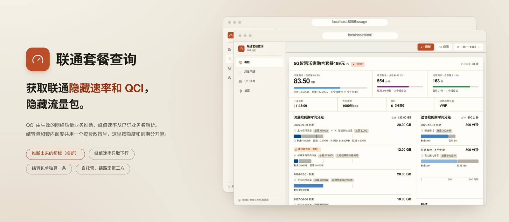
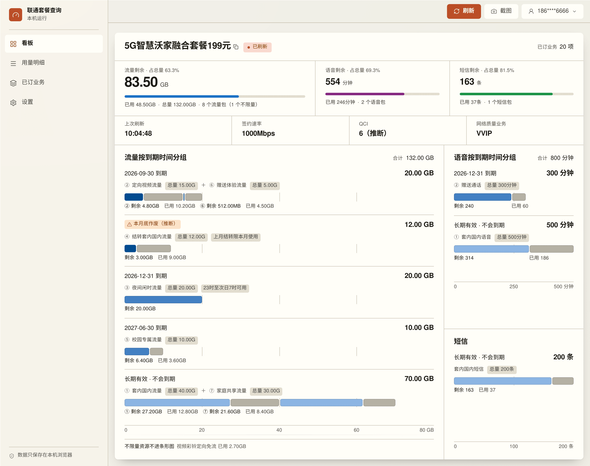
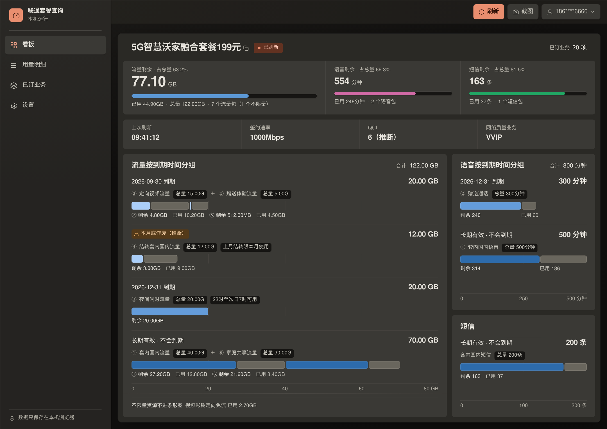
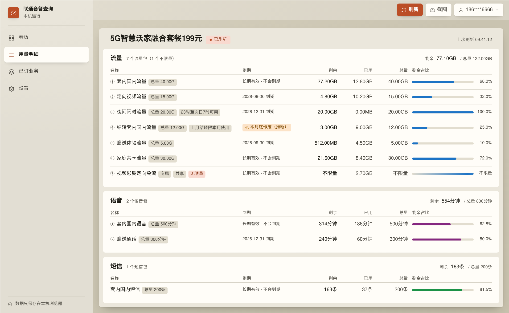
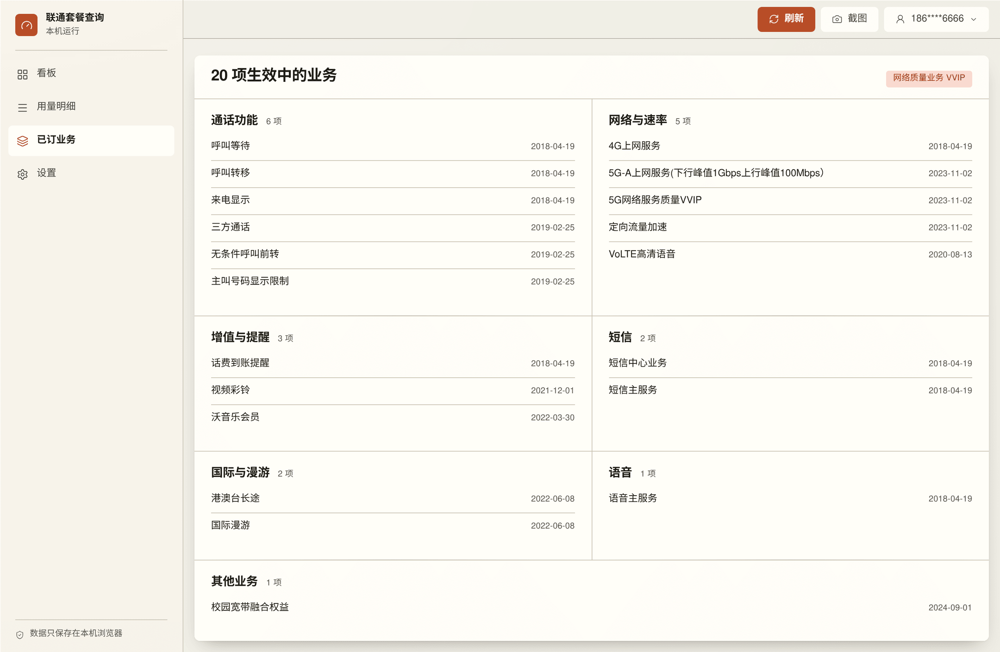
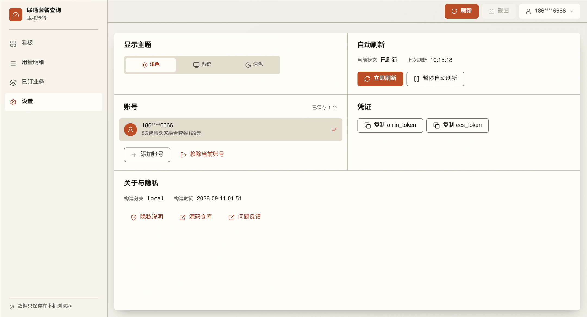
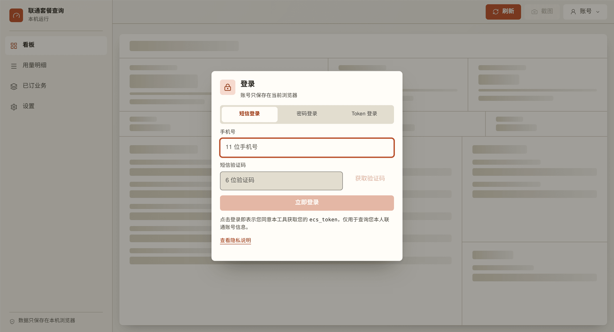
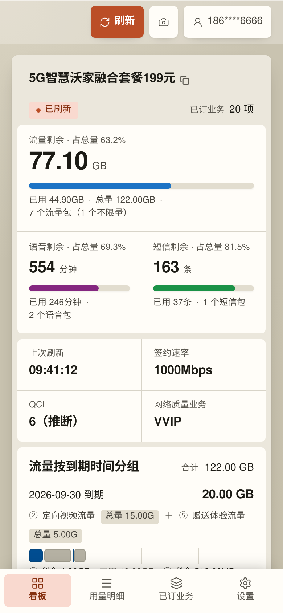
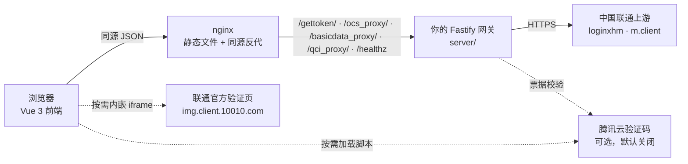

<div align="center">

<a href="README.md"></a>
<a href="README.zh-CN.md"></a>

<picture>
  <source media="(prefers-color-scheme: dark)" srcset="docs/screenshots/hero-dark.png" />
  <source media="(prefers-color-scheme: light)" srcset="docs/screenshots/hero-light.png" />
  
</picture>

# 余量面板

**联通不显示的速率和 QCI，这里算出来；结转、附赠这些容易被合并掉的流量包，这里一块不少。**
QCI 由生效的 5G 网络服务质量业务推断，峰值速率从已订业务名里解析，凡是推断出来的值都标着（推断）。结转包和套内额度共用同一个资费政策号，只按这个号去重整块就没了，所以这里按资费政策加上资源块自己的名称、额度、到期来认身份。套餐余量按到期时间分组一并给你，全部跑在自己的服务器上。

[](./LICENSE)
[](package.json)
[](package.json)
[](server/package.json)
[](docker-compose.yml)
[](https://github.com/yatotm/unicomvue/pulls)
[](https://github.com/yatotm/unicomvue/stargazers)

[快速开始](#快速开始) · [架构](#架构) · [技术栈](#技术栈) · [后端说明](server/README.md) · [接口与隐私](docs/api-and-privacy.md)

<sub>全部使用虚构的样例数据。题图和截图里的号码、套餐名和数值均为编造，未查询任何真实账号。</sub>

</div>

---

> **本项目不是中国联通的官方业务渠道。** 它只查询和展示账号信息，不会变更账号、套餐或任何已订业务。请仅查询本人或已获合法授权的号码，并遵守运营商服务规则。套餐权益、计费结果和业务生效状态，以中国联通官方系统和正式账单为准；本面板只是一个方便查看的视图，不是判定依据。

## 这是什么

联通自己的 App 会告诉你还剩多少流量，但不会告诉你这条号码跑在哪一档 QoS 上、签约的下行峰值是多少，也不会告诉你账号上是不是挂着一个限速业务。联通的已订业务接口**根本不返回 QCI 字段** —— 它返回的是一份已订业务清单。本面板读这份清单，把参数算出来，并且在界面上明说这是算出来的：

| 界面上的值 | 这个数到底怎么来的 | 算不出来时显示什么 |
| --- | --- | --- |
| `QCI 6（推断）` | 生效的 5G 网络服务质量业务：`5G网络服务质量VVIP` → 6，`5G网络服务质量VIP` → 8，取到清单但两者都没订 → 9（3GPP 默认承载）。比对前会去掉空格和括号，所以 `5G 网络服务质量（VVIP）` 照样命中，而 `VVIP网络服务包0元` 照样不命中。联通若明确返回 QCI 数字则以它为准，且不加标注。 | 完全取不到业务清单显示 `未确认`；接口本身失败保持 `—` |
| `签约速率 1000Mbps` | 取全部**签约类**来源中的最高值：基础信息接口的签约速率、已订业务接口的可用最高速率 `max_net_mbps`，以及每一条业务名里写明了下行峰值的在用业务各算一个候选。磁贴的悬浮提示会列出全部来源及各自的数值，可以逐项核对。 | 基础信息报 LTE 且没有任何来源给出数字时显示 `LTE`；没有任何来源给出正数时显示 `—` |
| `限速服务` 角标 | 在用清单里出现业务号 `50027` —— 或业务名恰为「限速服务」，或联通明确给了限速标志位。绝不靠「速率看着慢」去猜。 | 不显示角标 |
| `网络质量业务 VVIP` | 与推断 QCI 用的是同一次匹配，单独印成一块磁贴，让依据和结论并排摆着。 | `—` |
| `本月底作废（推断）` | 资源名里的「上月结转限本月使用」。联通没有任何字段说明这件事，而它给出的 `endDate` 往往是「长期有效」，照抄就会把这个包归进「永不过期」。 | 上游一旦换了措辞，这个包就退回按接口的到期日期分组 |

**峰值速率和 QCI 是两个参数，面板也把它们分开对待。** 签约 2000Mbps 的下行同样可能是 QCI 8。速率解析只读业务名里「下行」那一段 —— `5G-A上网服务(下行峰值2Gbps上行峰值200Mbps）` 得到 2000 而不是 200，括号全半角对不上也照样解析 —— 从那里解析出来的速率只改变速率磁贴，不改变别的任何东西。

**网关自己不做任何推断。** 它只上报在用业务清单、`has_service_list` 布尔值、限速标志、联通给的最高速率，以及联通万一真给了 QCI 数字时的那个数字；解释这一步交给浏览器，由 [`src/domain/usage.js`](src/domain/usage.js) 里的纯函数完成。正因为这样分工，推断错了是一个你读得到的 bug，而不是一个只能选择相信的数字。

余量是另一半，那一半本来就是基本功 —— 联通自己也印。联通不做的是告诉你**哪一个** 30GB 到月底就作废，所以这里把它们按到期时间归成一条条 lane。

用联通号码登录后，这些内容拆成四个页面，每个都有自己的地址 —— `lg:` 起靠 264px 的侧栏切换，以下换成底部标签栏：

| 路径 | 页面 | 上面有什么 |
| --- | --- | --- |
| `/` | 看板 | 套餐名称、连接状态与限速角标；流量、语音、短信各一个余量数值配一条占比条；上次刷新、签约速率、QCI、网络质量业务四块参数磁贴，每块都把自己的推断依据写在悬浮提示里；流量、语音、短信按到期时间分组的条形图 |
| `/usage` | 用量明细 | 每类资源一张对齐表格 —— 名称、到期、剩余、已用、总量、剩余占比 —— 上方是套餐抬头和上次刷新时间 |
| `/services` | 已订业务 | 号码上当前生效的全部业务，按类别分组，附生效日期 —— 包括 QCI 与速率两块磁贴所依据的网络质量业务和带速率的业务 |
| `/settings` | 设置 | 主题、自动刷新、账号管理、凭证复制、隐私说明与构建信息 |

每条路由就是一张卡片，这张卡片就是整页 —— 里面的各个区域靠卡片画出来的横线分开，而不是各自再当一张卡片。页面按需加载，认不出的路径一律重定向回看板。支持保存并切换多个账号，每 30 秒自动刷新，顶栏的截图按钮把当前路由那张卡片拍下来，不用另外录屏。

应用保存的所有数据都在浏览器的 `localStorage` 里，服务端不落盘任何内容。

<details>
<summary><b>界面截图</b> —— 四个页面、深色主题、手机布局、登录窗口</summary>

<table>
  <tr>
    <td width="50%" align="center">
      <br>
      <sub>看板 · 浅色</sub>
    </td>
    <td width="50%" align="center">
      <br>
      <sub>看板 · 深色</sub>
    </td>
  </tr>
  <tr>
    <td width="50%" align="center">
      <br>
      <sub>用量明细</sub>
    </td>
    <td width="50%" align="center">
      <br>
      <sub>已订业务</sub>
    </td>
  </tr>
  <tr>
    <td width="50%" align="center">
      <br>
      <sub>设置 —— 注意这一页的截图按钮是禁用的</sub>
    </td>
    <td width="50%" align="center">
      <br>
      <sub>登录窗口</sub>
    </td>
  </tr>
  <tr>
    <td width="50%" align="center">
      <br>
      <sub>手机布局 · 390&nbsp;px 宽</sub>
    </td>
    <td width="50%" align="center"></td>
  </tr>
</table>

图中数值均为虚构的样例数据。

</details>

## 为什么要自己跑

手机号、短信验证码和联通会话 Token 就是一个手机账号的钥匙。本面板的设计前提是：它们只在三方之间流动 —— 你的浏览器、你自己运行的网关、中国联通。链路里没有第三方接口，也没有哪个构建开关会悄悄塞进来一个。

| 关注点 | 本项目的做法 |
| --- | --- |
| 后端 | [`server/`](server/README.md) —— 自己运行的 Fastify 5 网关，也是唯一持有到 `10010.com` 连接的进程 |
| 凭证路径 | 浏览器 → 你的网关 → 中国联通，中间没有第三方 |
| 登录 | 短信验证码、联通登录密码，或直接填 `ecs_token`；联通要求页内图形验证时在流程中原地完成 |
| 查询鉴权 | 按账号保留完整的联通 Cookie 会话 —— 余量接口实际要求的正是它 |
| 额外验证码 | 默认关闭。开启时使用**你自己**的腾讯云应用凭据，AppID 由后端在运行时下发，不写死进产物 |
| 持久化 | 只有浏览器 `localStorage`。服务端无数据库、不写文件，限流计数和待恢复请求只存在进程内存里 |
| 部署方式 | Docker Compose（nginx + API）、静态构建配自己的反代，或单独构建镜像 |

## 亮点

- **联通从不下发的 QCI。** 已订业务接口里压根没有 QCI 字段。浏览器按生效的 5G 网络服务质量业务推断等级 —— VVIP → 6，VIP → 8，取到清单但两者都没订 → 9 —— 并印成 `6（推断）`。联通若明确返回数字，以数字为准且不加标注。
- **下行峰值从业务名里解析出来。** `下行峰值2Gbps上行峰值200Mbps` 得到 2000 而不是 200，括号全半角对不上也照样解析。磁贴显示签约速率、接口最高速率和全部带速率业务中的最高值，悬浮提示把它们连同各自的数值一并列出。
- **限速是认出来的，不是猜出来的。** 业务号 `50027` —— 或业务名恰为「限速服务」，或联通明确给的限速标志位 —— 才会点亮角标；速率看着慢永远不会。
- **完整的已订业务清单，单独一页。** 按类别分组并附生效日期，认不出编号的业务落进「其他业务」兜底而绝不被丢掉；网关侧的字段白名单把手机号和姓名留在了后端。
- **推断出来的值一律承认自己是推断，降级也说清楚。** 凡是推断都带 `（推断）`，取不到业务清单显示 `未确认`，接口失败保持 `—`，上月结转的包挂 `本月底作废（推断）`。联通一旦换了措辞，面板退回去而不是接着猜。
- **资源按「什么时候作废」分组。** 联通一口气返回好几个同名的包，面板把它们按到期时间归成一条条 lane，近的排前面 —— 「哪个 30GB 是这个月底就没了的」终于有答案。
- **全链路自托管。** 浏览器 → 你的 Fastify 网关 → `10010.com`，链路里不存在任何第三方接口。
- **服务端零持久化。** 限流计数和待恢复请求只存在进程内存里，重启即清空。没有数据库，也不写文件。
- **副卡数据不出网关。** 余量响应和已订业务清单各自按显式白名单逐字段重建，`viceCardlist`、`userMobile`、`usernumber`、`username` 在写回响应之前就被丢掉。
- **图表不编时间轴。** 什么都不落盘，也就没有历史可画。所有图形只做占比和对比，全部用 CSS 手写，不引图表库，零新增依赖。
- **三种登录入口。** 短信验证码、联通登录密码，或直接填 `ecs_token`；联通要求页内验证时在流程中原地完成。
- **一条命令部署。** `docker compose up -d` 起 nginx 和 API，带健康检查门控和日志轮转。
- **日志可以直接贴进 Issue。** 只记请求 ID、路由、HTTP 状态、联通业务码和响应字段结构，不记正文、Token、Cookie 和手机号。

<details>
<summary><b>完整功能列表</b> —— 登录、四个页面、账号、界面、后端</summary>

**登录**

- 短信验证码，60 秒重发倒计时
- 联通登录密码（8–20 位，保留大小写和符号）—— 由网关加密后提交上游，不写入账号列表也不写入日志
- 联通官方验证页，内嵌并双向校验来源，用于 `ECS99999` / `ECS99998` 验证分支
- 直接填写从别处取得的 `ecs_token`
- 可选的腾讯云验证码，挡在短信接口之前，默认关闭
- 手机上是底部抽屉，`sm:` 起是居中对话框

**看板**（`/`）

- 套餐名就是这张卡片的标题；点一下复制 `onlin_token`，长按复制 `ecs_token`。连接状态和生效业务数排在同一行
- 限速业务按独立的 `50027` 业务标识识别 —— 或业务名恰为「限速服务」，或联通给了限速标志位 —— 在同一行里以角标提示
- 流量、语音、短信各给一个余量数值、它占总量的比例，以及一条占比条。有分母的那一档排在最前，占用全屏唯一的 34px 主数字
- 联通返回的剩余与已用加起来对不上总量时，百分比和条形一并撤掉，那一格挂上「数字对不上」—— 数字照印，因为那确实是接口返回的
- 上次刷新、签约速率、QCI、网络质量业务四块参数磁贴：QCI 的提示写明所用映射，签约速率的提示逐条列出比较过的来源及各自数值，网络质量业务那一块印的就是 QCI 读自哪一档订购
- 流量、语音、短信按到期时间分成一条条 lane：一条 lane 一个到期时间，按紧迫度排序，条长是绝对额度，全部 lane 共用一把刻度
- 上月结转的包挂「本月底作废（推断）」角标 —— 推断出来的结论，明确标成推断
- 不限量的包没有分母，因此不进条形图，只在脚注里报出它的绝对已用量

**用量明细**（`/usage`）

- 抬头一行印齐套餐名称、连接状态、限速角标和上次刷新时间
- 流量、语音、短信各一张对齐表格，列为名称、到期、剩余、已用、总量、剩余占比；手机上每行折成上下几行
- 条目带 ①②③ 编号，同名的两个包因此仍分得清；联通返回整组同名条目时，编号规则印在表格下面
- **只标例外，不标默认值**：专属 / 其他 / 类型未知、无限量，以及不限量包的共享属性，照常标出；「通用」和「有上限」是常态，不逐行印
- 不限量的行占比一栏印「不限量」，条形换成一条扫过的不确定进度条，而不是画到底的实条
- 空态区分「运营商返回 0 条」和「运营商压根没返回这个分组」，两句文案不一样

**已订业务**（`/services`）

- 列出号码上当前生效的全部业务及其生效日期，按类别归组 —— 网络与速率、语音、短信、通话功能、增值与提醒、国际与漫游 —— 并有「其他业务」兜底，认不出编号的业务也不会被丢掉
- 归组先认业务编号，编号认不出时再按业务名关键词兜底；分组按条目数从多到少排列，兜底组永远压最后
- 生效业务总数与网络质量业务等级印在分组上方；「清单为空」和「压根没取到清单」是两种不同的空态，文案也不同

**设置**（`/settings`）

- 浅色、深色、跟随系统三种主题
- 每 30 秒自动刷新，可暂停，也可手动刷新，并显示最近一次成功查询的时间
- 账号列表，支持切换、添加、移除
- 复制 `onlin_token` 与 `ecs_token` 的按钮
- 隐私说明、源码仓库与问题反馈入口，以及构建分支、提交和构建时间
- 这一页的截图按钮是禁用的 —— 它只有控件，没有可分享的数据

**账号**

- 多账号保存、切换、移除
- 每个账号带自己的联通 Cookie 会话，随每次查询提交
- 查询失败不会静默删账号；同一凭证只提示一次重新登录，随后停止自动重试

**界面**

- 控制台式外壳：264px 侧栏里是四个 `RouterLink`，当前项带 `aria-current="page"`，顶栏吸顶。`lg:` 起整个外壳锁死在一屏高，滚动条归主区所有；`lg:` 以下由文档滚动
- **顶栏只有控件，没有页面标题** —— 刷新、截图、账号三个。页面名由 `document.title` 和主区里一个只给读屏器的 `<h1>` 承担，标签页和标题大纲一样不少
- 顶栏就是画布色，静止时靠一条发丝线加一道柔和落影分界。`lg:` 以下滚动时，它自己的底色、那条线和 18px 的背景模糊在前 160px 里一起加深；`lg:` 以上它在滚动容器外面，进度恒为 0，于是它就是一块纯粹的半透明外壳面
- **手机用底部标签栏，不用汉堡抽屉**：四个目的地正好放得下，于是一次点击到位，也不必再开一个要陷住焦点的对话框。侧栏和标签栏读的是同一份 `NAV_ITEMS`，两处不会漂移
- 顶栏只有一个主操作。刷新是唯一的填充按钮，截图和账号菜单都是安静的图标按钮。主题、暂停、添加 / 移除账号、隐私说明和构建信息全部收进「设置」
- **表面模型只有一套。** 一页一张卡片，卡片内部的区域不带底色、不带描边、不带圆角、不带阴影 —— band 之间那几条通到两边的横线由卡片自己画，所以线的条数恒等于它的直接子元素数减一。嵌套卡片没有了，托盘色 `--ui-surface` 也随之删除，不是留着不用。chip、进度轨、输入框、分段控件的轨道和几种语义容器仍保留填色；只有真正的浮层 —— 账号菜单、提示条和两个对话框 —— 才有阴影。依据是 Material 3 对卡片的定义：卡片是一个被包住的单一单元，它内部的分隔手段是 divider，不是再来一层卡片
- 分界机制只有三种，各司其职：卡片自己的 `divide-y` 画 band 之间的全宽线，接缝网格（`.ui-seams`）用 1px gap 画并排区域之间的缝，列表和表格的行分隔用被内边距缩进的 `border-t`。四条路由加起来一共七条全宽线，每一条都登记在契约的 `CARD_BANDS` 表里
- 四条路由的卡片是同一个矩形 —— 同上边、同左边、同宽 —— 主区的高度是它的**下限**而不是上限：内容短的一页补白落在卡片自己里，到期分组图也就不会连刻度尺一起被裁掉
- 同一行的兄弟区域底边对齐，因为接缝网格的格子天然等高。内容超出的那一块在自己内部滚动，不把整行撑高，并用遮罩渐变、一个 tab 停靠点和中文 `aria-label` 声明「我在滚」
- **样式收敛成一层。** 十三种反复出现的图形各有唯一出处：十个组件（`AppCard`、`AppSection`、`StatusChip`、`SegmentedControl`、`AccountList`、`ProgressTrack`、`DialogHeader`、`TextField`、`SkeletonSection`、`SectionNote`），加上 [`src/utils/ui.js`](src/utils/ui.js) 里的三条 class 配方（标题行与全项目唯一的横向插入量、抬头标题的字号、按钮底座及其五个变体）。收敛前，22 个 `.vue` 里有 229 条互不相同的多 token class 串，其中 43 条逐字重复出现在多个文件里；收敛后是 196 条和 22 条。某个图形一旦长出第二个出处，`tests/uiContract.test.js` 立刻变红
- 参照 Claude 的产品表面：暖白画布，往上一档是卡片面，往下一档是行内填色 —— 两块面加一档凹陷，没有梯子 —— 再配一支陶土 / 珊瑚色的品牌色，只管品牌与控件。数据另有自己验证过的几套：表示到期紧迫度的单色有序色阶、按资源种类固定分配的三槽分类色板，以及表示「已用」的暖中性灰。**品牌色刻意不作数据色**
- 处处是闭集：五级字号（12 / 14 / 17 / 22 / 34）、两档字重、十种文字颜色、8 / 6 / 4 三档圆角外加一个真正的圆。设计 token 定义在 `src/assets/base.css`，在 `src/assets/main.css` 映射为 Tailwind 颜色名；任何 `.vue` 都不许写死颜色值
- [`docs/ui-guidelines.md`](docs/ui-guidelines.md) 是所有 `.vue` 文件必须遵守的契约，`tests/uiContract.test.js` 在真实 DOM 里断言其中可度量的那一半 —— 画布渐变最糟点上的对比度、任意两块相邻表面之间的步进、字号 / 字重 / 文字颜色的闭集、「一个图形一个出处」、「卡片内部没有卡片」、band 数、唯一的横向插入量、路由形状、底部标签栏、顶栏里不许出现页面标题、44px 触控下限，以及减少动效规则
- 所有覆盖层共用同一个关闭原语（`useDismissable`）：面板之外的 `pointerdown`、document 捕获阶段的 Escape、焦点离开面板、路由变化，关闭后焦点归还触发它的控件
- 图表几何只在数据变化时过渡，没有任何循环动画；`prefers-reduced-motion: reduce` 下降到 1ms，骨架和不限量条那两处扫光一并停住
- 应用内隐私说明直接渲染 `docs/api-and-privacy.md`，文档和界面不会各说各话

**后端**

- 短信、登录、验证码校验按手机号和 IP 分别限流，窗口为小时
- 默认只接受同源浏览器请求，跨域来源需通过 `ALLOWED_ORIGINS` 显式放行
- 可选的 API 共享密钥 `ACCESS_TOKEN`，按常数时间比较
- 请求正文上限 16 KiB，上游响应上限 2 MiB，请求超时 30 秒，所有响应带 `no-store` 与 `nosniff`
- 独立的 HTTP/HTTPS Agent，显式忽略 `HTTP_PROXY` / `HTTPS_PROXY`
- 携带凭证的请求不跟随重定向
- 响应头 `X-Request-ID` 可把同一次请求的 `api.response` 与 `unicom.response` 日志串起来

</details>

<details>
<summary><b>验证状态与已知限制</b> —— 哪些在真实号码上跑通了</summary>

已用真实账号验证：密码登录、联通官方页内图形验证、完整 Cookie 鉴权下的余量查询（含连续自动刷新）、基础信息速率接口、已订业务接口。

尚未端到端验证：短信发送与短信登录。直连探测 `/mobileService/sendRadomNum.htm` 和 `/mobileService/radomLogin.htm` 返回 HTTP 200 和号码校验错误，这只证明链路可达，不代表短信真的发出去了。

其他需要知道的限制：

- 联通未明确返回 QCI 数字时，由已订业务清单推断，推断值带 `（推断）` 标注；完全取不到业务清单时显示 `未确认`，接口本身失败时保持 `—`。这套映射在真实号码上核对过，但它终究是一套映射，不是联通下发的字段。
- 页面上的速率取联通返回的全部**签约值**中的最高值：套餐签约速率、已订业务接口的可用最高速率，以及每一条业务名里写明了下行峰值的在用业务。全部来源连同各自的数值都列在这块磁贴的悬浮提示里，可以逐项核对。它们都不是实时测速结果，也都不参与 QCI 判断。
- 从业务名里解析速率要看联通怎么措辞：只认带单位的数字，且只取业务名里「下行」那一段 —— 所以 `5G上网服务` 得到的是 0 而不是 5Gbps，`提速包（上行200Mbps）` 得到的也是 0 而不是 200。
- 业务是否在用以联通的 `servicestate` 为准：数字串取 `"1"`，仍返回中文状态的响应形态则排除已退订 / 失效 / 未生效一类的文案。已退订的网络质量业务因此不会再把 QCI 抬高。
- 「本月底作废（推断）」同样是推断，依据是资源名里的「上月结转限本月使用」—— 接口没有对应字段。上游一旦换了措辞，这个包就退回按接口的到期日期分组，面板绝不假装知道。
- `ECS1500 / type=4` 是人脸验证。联通页面调用的是浏览器无法执行的 `faceV3Detect` 原生能力，界面会直接说明，不会偷偷降级成更弱的校验方式。
- 限流是单进程内存实现，不适合多副本共享。
- 不同账号、不同省份的行为可能不一样。联通字段名也会变；调整点是 `normalize.js` 和 `UNICOM_*_PATH` 变量。

</details>

## 图表

面板只轮询「当前余量」，什么都不落盘。没有历史可画，**因此项目里没有任何趋势图** —— 时间轴只能靠编。所有图形只回答占比和对比的问题，用的全是本次刷新联通返回的数值：

| 图形 | 形态 | 回答什么 |
| --- | --- | --- |
| 到期分组（[`ExpiryLanes.vue`](src/components/ExpiryLanes.vue)） | 一条 lane 一个到期时间；条长是绝对额度，共用一把从 0 开始的刻度 | 什么时候作废、到那时还剩多少 |
| 概览条（[`DashboardHero.vue`](src/components/DashboardHero.vue)） | 每类资源一条 6px 的 [`ProgressTrack`](src/components/ProgressTrack.vue)，填色是这类资源的分类色 | 流量、语音、短信各自对着自己的上限还剩多少 |
| 剩余占比条（[`ResourceTable.vue`](src/components/ResourceTable.vue)） | 同一个 `ProgressTrack`，每行一条 | 哪个包快用完了 |

lane 的顺序就是紧迫度：本月内（含推断出来的结转包）→ 有明确到期日（日期升序）→ 长期有效 → 到期未知。共用刻度的上界取到人读得出的整数 —— 80GB、500 分钟，而不是 78.13GB。一条 lane 里每个包先画剩余段（到期色阶），再画已用段（中性灰），每一段旁边都印着自己的数值，读数不必靠眼睛去对颜色。

四条正确性规则摆在界面上，而不是含糊过去：

- **推断出来的结论必须承认自己是推断**，并带上推断依据 —— `6（推断）`、`本月底作废（推断）`，悬浮提示里写清楚它是从什么推出来的。`tests/uiContract.test.js` 会断言这个标签存在、断言它解释得了自己，并拒绝一枚没有理由的角标。
- **不限量的包没有分母**，所以它不进任何占比图。看板上它是一行脚注，只报绝对已用量；用量明细里它拿到一条扫过的不确定进度条和「不限量」三个字，而不是一个百分比。
- **联通没给占比的行不画条。** 空轨道就是诚实的画法，占比一栏显示 `—`。
- **「剩余 + 已用 ≠ 总量」绝不抹平。** 看板的概览格直接撤掉这类资源的占比和条形，并挂上「数字对不上」；到期分组里条形按总量钳位、画不出刻度，出问题的包在 lane 下面被逐条点名。两处都宁可不给百分比，也不拿钳位后的数算一个假的，联通原样返回的数字照印不误。

曾经短暂存在过一张「本月消耗去向」点图，后来因为重复而删掉：每条 lane 本来就画着已用段、也印着自己的已用量，点图只是把同一批数字在同一屏里换个方式再画一遍。

全部手写：lane 用 flex 加绝对定位，条形用 CSS 宽度。**不引图表库，零新增依赖。** 图表色板和界面其余部分同在一层 token 里，图表不可能选出主题没有定义过的颜色。

## 架构



前端不直接连任何联通接口。它只请求同源路径，生产环境由 nginx、本地由 Vite 开发代理转发到网关，只有网关持有到 `10010.com` 的连接。两条虚线是例外：联通自己的验证页以 iframe 内嵌，来源和路径由前后端各校验一次；腾讯验证码脚本只在启用验证码且联通要求时才按需加载。

## 快速开始

直接用已发布的镜像，不必克隆，也不必构建：

```bash
curl -fLO https://github.com/yatotm/unicomvue/releases/latest/download/docker-compose.yml
docker compose pull
docker compose up -d
```

打开 <http://localhost:8086>。

想自己编译，同一个文件也能从源码构建：

```bash
git clone https://github.com/yatotm/unicomvue.git
cd unicomvue
docker compose up -d --build
```

对外只映射网页端口，API 留在 Compose 网络内的 `api:8788`。改端口在 compose 文件旁边的 `.env` 里设 `WEB_PORT`；需要局域网访问设 `WEB_HOST=0.0.0.0`。`server/.env` 可以不建，需要改后端默认值时再补。需要 Docker Compose 2.24+。

<details>
<summary><b>本地开发</b> —— 环境要求、命令、端口</summary>

**环境要求**

- Node.js `^20.19.0` 或 `>=22.12.0`
- pnpm `10.30.3`，建议用 Corepack 固定版本：

```bash
corepack enable
corepack prepare pnpm@10.30.3 --activate
```

**启动**

```bash
pnpm install --frozen-lockfile
cp .env.example .env
cp server/.env.example server/.env
pnpm dev
```

`pnpm dev` 同时启动前后端：前端 <http://localhost:5173>，API 监听 `127.0.0.1:8788`。也可以用 `pnpm dev:web`、`pnpm dev:api` 单独启动 —— 连接已经跑在别处的网关时只起 `dev:web` 即可。

`VITE_API_BASE_URL` 保持为空。Vite 的开发和预览代理直接读 `server/.env` 里的 `HOST` 和 `PORT`，改后端端口不需要改第二处；想指向别的地址就用 `VITE_DEV_API_TARGET` 覆盖。开发端口是严格模式，被占用时明确报错，不会静默换端口。

**检查与构建**

```bash
pnpm run lint          # 先 oxlint，再 eslint
pnpm run lint:fix
pnpm test              # 前端 + 后端全部用例
pnpm run build         # → dist/
pnpm preview
```

`pnpm preview` 只提供构建后的前端，API 仍需另行运行。

</details>

<details>
<summary><b>部署</b> —— Compose、静态文件、单独 Docker、发布与 CI</summary>

### Docker Compose（推荐）

栈由两个服务组成，同一个文件覆盖两条路径：每个服务同时写了 `image:` 和 `build:`，`docker compose pull` 拉已发布的镜像，`docker compose up -d --build` 则从源码构建出同样的一套。

| 变量 | 默认值 | 作用 |
| --- | --- | --- |
| `IMAGE_NAMESPACE` | `yatotm1994` | 拉取镜像的 Docker Hub 命名空间。fork 之后改成自己的账号。 |
| `IMAGE_TAG` | `latest` | 固定到某个发行版本，例如 `IMAGE_TAG=v1.0.0`，不再跟随 `latest`。 |

`api` 来自 [`server/Dockerfile`](server/Dockerfile)（node:22-alpine，只装网关自己的依赖，非 root 运行），网络内以 `api:8788` 访问。`web` 来自根目录 [`Dockerfile`](Dockerfile)：先编译前端，再交给 nginx，[`deploy/nginx.conf`](deploy/nginx.conf) **已经打进镜像**，所以纯拉取部署除 compose 文件外不需要落地任何文件。`web` 等 API 健康检查通过后才启动。

Compose 会覆盖 API 容器的 `HOST`、`PORT` 和 `TRUST_PROXY`，所以宿主机上已被占用的后端端口不影响容器。`server/.env` 是可选的（`required: false`），缺失时网关按默认值启动。容器日志最多保留 3 个 10 MiB 文件。

```bash
docker compose pull                        # 已发布的镜像
docker compose up -d

docker compose up -d --build               # 或者全部从源码构建
docker compose logs --since 10m --timestamps api
docker compose up -d --no-deps web         # 修改 WEB_HOST / WEB_PORT 后
```

三个 `VITE_*` 是构建期编译进产物的，只对本地构建生效，compose 会把它们作为构建参数传下去。已发布的镜像用的是默认值：同源 API、无访问令牌 —— 也就是说，给网关配了 `ACCESS_TOKEN` 就必须自己构建网页镜像。

nginx 只反代五个路径 —— `/gettoken/`、三个 `*_proxy/` 和 `/healthz` —— 并通过 `127.0.0.11` 动态解析 `api` 服务名，重建 API 容器后不会卡在旧 IP 上。其余请求一律走 `try_files $uri $uri/ /index.html`，所以 `/usage`、`/services`、`/settings` 刷新或直接粘贴链接都能打开，不会 404。同一段配置还把请求正文限制在 16k，并下发 `Referrer-Policy: no-referrer`。

不想重新构建又要改这段配置，就用自己的文件盖住镜像里的那份 —— 每个发行版本都附带 `nginx.conf`：

```yaml
services:
  web:
    volumes:
      - ./nginx.conf:/etc/nginx/conf.d/default.conf:ro
```

### 静态文件

执行 `pnpm run build` 后部署 `dist/`，并在 Web 服务器上把上面五个 API 路径反代到网关；或者把 `VITE_API_BASE_URL` 指向自己的网关地址后重新构建。由于路由用的是真实地址而不是 hash 锚点，这台服务器同样需要把未匹配的路径重写到 `index.html`，参照 [`deploy/nginx.conf`](deploy/nginx.conf) 即可。**只部署静态文件是没有 API 的** —— 产物里不存在可回退的兜底地址。

### 单独构建 Docker 镜像

两个 Dockerfile 都是多阶段、自包含的：干净的检出目录直接就能构建，不需要先 `pnpm install`，也不需要先 `pnpm run build`。运行层只留产物和网关代码，不带 `node_modules`，也不带源码。

```bash
docker build -t unicomvue-web:local .
docker build -f server/Dockerfile -t unicomvue-api:local .
```

网页镜像监听 80，并要求能以 `api:8788` 访问到网关；API 镜像以非 root 的 `node` 用户监听 8788。脱离 Compose 单独运行时，这条内部网络得自己搭。

### 公网部署

在网页和 API 之前统一终止 HTTPS，并在那一层配置真正的访问控制 —— VPN、反向代理认证，视情况而定。`VITE_API_ACCESS_TOKEN` 会被编译进公开的 JavaScript，它不是站点密码。如果 TLS 在外层代理终止，需要把公网 HTTPS 来源填进 `ALLOWED_ORIGINS`。

### 发布与 CI

[`.github/workflows/docker-publish.yml`](.github/workflows/docker-publish.yml) 在推送 `main`、打 `v*` 标签和手动触发时运行，分三步：

1. **检查与构建** —— `pnpm run lint`、`pnpm test`、`pnpm run build`。测试不过就不会发布任何东西。
2. **推送镜像** —— 两个镜像各构建 `linux/amd64` 与 `linux/arm64`，以 `unicomvue-web`、`unicomvue-api` 推到 Docker Hub。
3. **创建发行版** —— 只在 `v*` 标签上执行，自动生成发布说明，并附上部署所需的文件。

推 `main` 会发布 `main` 标签；打 `v1.2.3` 会发布 `v1.2.3`、`1.2.3`、`1.2`、`1` 和 `latest` 五个镜像标签，所以 `IMAGE_TAG` 填 Git 标签或纯版本号都能拉到。**`latest` 只跟随版本标签移动，分支推送不会动它** —— `docker compose pull` 默认解析的就是 `latest`，没固定版本的部署者应该落在最近一个发行版上，而不是分支最新提交上。当前发行版是 `v1.0.0`，所以现在 `latest` 和 `v1.0.0` 指向同一对镜像。

fork 之后要在 **Settings → Secrets and variables → Actions** 里加两个仓库密钥：

| 密钥 | 值 |
| --- | --- |
| `DOCKER_USERNAME` | 你的 Docker Hub 账号，同时也是镜像命名空间。部署时把 `IMAGE_NAMESPACE` 设成同一个值。 |
| `DOCKER_PASSWORD` | 有写入权限的 Docker Hub 访问令牌。 |

任意一个为空时推送任务会直接报错退出，而不是把镜像推进一个没有归属的命名空间。发行版那一步用内置的 `GITHUB_TOKEN`，无需额外配置。

每个发行版附带 `docker-compose.yml`、`nginx.conf`、`env.example` 和 `server.env.example`。这些文件加上两个镜像就是一套完整部署，不需要克隆仓库。

</details>

<details>
<summary><b>配置</b> —— 全部环境变量</summary>

两个配置文件都是可选的，各自旁边有对应的 `.env.example`。网关始终按仓库位置读取 `server/.env`，与命令执行目录无关；系统环境变量优先于文件。改完需要重启。

### 根目录 `.env` —— 构建与 Compose

| 变量 | 默认值 | 说明 |
| --- | --- | --- |
| `VITE_API_BASE_URL` | 空 | 打包进产物的网关地址。留空即同源，配合 nginx 或开发代理时就应该留空。 |
| `VITE_API_ACCESS_TOKEN` | 空 | 需与网关的 `ACCESS_TOKEN` 一致。会出现在发布的 JavaScript 里，不是密码。 |
| `VITE_CAPTCHA_APP_ID` | 空 | 仅在连接第三方兼容后端时需要填。仓库自带的网关会在运行时返回自己的 AppID。 |
| `VITE_DEV_API_TARGET` | 空 | 覆盖开发/预览代理目标。留空表示「读 `server/.env` 的 `HOST` 和 `PORT`」。 |
| `WEB_HOST` | `127.0.0.1` | Compose 绑定网页端口的地址。需要局域网访问改 `0.0.0.0`。 |
| `WEB_PORT` | `8086` | 对外网页端口。API 完全不对外映射。 |
| `IMAGE_NAMESPACE` | `yatotm1994` | Compose 拉取两个镜像的 Docker Hub 命名空间。fork 后改成自己的账号。 |
| `IMAGE_TAG` | `latest` | 运行的镜像标签。填 `v1.0.0` 之类可固定版本，不再跟随 `latest`。 |

### `server/.env` —— 网关

| 变量 | 默认值 | 说明 |
| --- | --- | --- |
| `HOST` | `127.0.0.1` | 监听地址，Compose 覆盖为 `0.0.0.0`。 |
| `PORT` | `8788` | 监听端口，Compose 在容器内覆盖为 `8788`。 |
| `ALLOWED_ORIGINS` | 空 | 额外允许的浏览器来源，逗号分隔。留空只允许同源。必须是纯 `http(s)` 来源，不能带路径、查询串或凭证。 |
| `TRUST_PROXY` | 空 | 可信代理的 IP/CIDR 列表或跳数。填 `true` 会直接报错。Compose 设为 `1`。 |
| `ACCESS_TOKEN` | 空 | 可选的共享密钥，经请求正文 `access_token` 提交。 |
| `DEBUG_RAW` | `false` | 在响应中附带上游原始报文 `_raw`。仅供诊断 —— 其中可能包含完整手机号和凭证。 |

**上游**

| 变量 | 默认值 | 说明 |
| --- | --- | --- |
| `UNICOM_BASE_URL` | `https://m.client.10010.com` | 查询域名。 |
| `UNICOM_LOGIN_BASE_URL` | `https://loginxhm.10010.com` | 登录与短信域名。 |
| `UNICOM_APP_VERSION` | `android@13.0000` | 上送的客户端版本号。 |
| `UNICOM_APP_ID` | `ChinaunicomMobileBusiness` | 客户端应用标识。 |
| `UNICOM_TIMEOUT_MS` | `15000` | 覆盖连接、响应头和完整正文。 |
| `UNICOM_SEND_SMS_PATH` | `/mobileService/sendRadomNum.htm` | 必须落在 `UNICOM_BASE_URL` 下。 |
| `UNICOM_LOGIN_PATH` | `/mobileService/radomLogin.htm` | 短信登录。 |
| `UNICOM_PASSWORD_LOGIN_PATH` | `/mobileService/login.htm` | 密码登录，不能替代短信登录路径。 |
| `UNICOM_OCS_PATH` | `/servicequerybusiness/operationservice/queryOcsPackageFlowLeftContentRevisedInJune` | 套餐与余量。 |
| `UNICOM_BASIC_DATA_PATH` | `/servicebusiness/query/fiveg/getbasicdata` | 脱敏号码、签约速率。 |
| `UNICOM_QCI_PATH` | `/servicebusiness/newOrdered/queryOrderRelationship` | 已订业务。 |

**限流**（每小时，固定窗口，内存实现）

| 变量 | 默认值 |
| --- | --- |
| `SMS_LIMIT_PER_PHONE_HOUR` | `5` |
| `SMS_LIMIT_PER_IP_HOUR` | `10` |
| `LOGIN_LIMIT_PER_PHONE_HOUR` | `20` |
| `LOGIN_LIMIT_PER_IP_HOUR` | `60` |
| `CAPTCHA_LIMIT_PER_IP_HOUR` | `60` |

**验证码** —— 这是网关在短信接口前**额外**加的一道闸，与联通自己的身份验证互不相干。走联通官方验证页不需要开它。

| 变量 | 默认值 | 说明 |
| --- | --- | --- |
| `CAPTCHA_ENABLED` | `false` | 开启但缺少下面两项凭据会拒绝启动。 |
| `CAPTCHA_APP_ID` | 空 | 你自己注册的腾讯云验证码应用。会在 `need_captcha` 响应里返回给前端，无需重新构建。 |
| `CAPTCHA_APP_SECRET` | 空 | 只保留在服务端。 |
| `CAPTCHA_TIMEOUT_MS` | `10000` | 票据校验超时。 |

校验通过的票据绑定手机号和客户端 IP，只能使用一次，五分钟后过期（`CAPTCHA_TTL_MS`）。

[`server/src/config.js`](server/src/config.js) 还会读取几个未写入 `.env.example` 的开关，因为默认值几乎总是对的：`LOG_LEVEL`（pino 日志级别，默认 `info`）、`UNICOM_ECS_ACC`、`UNICOM_DEVICE_BRAND`、`UNICOM_DEVICE_MODEL`、`UNICOM_ANDROID_VERSION` 和 `CAPTCHA_TTL_MS`。所有配置在启动时校验，取值非法直接抛错，不会被静默转换。

</details>

<details>
<summary><b>接口</b> —— 浏览器直接调用的路径</summary>

请求正文均为 JSON 对象，上限 16 KiB。前端使用 `Content-Type: text/plain;charset=UTF-8`，同时兼容 `application/json`。所有响应均为 `no-store`。

| 方法 | 路径 | 用途 |
| --- | --- | --- |
| `POST` | `/gettoken/?action=send` | 请求短信验证码，可能返回验证要求 |
| `POST` | `/gettoken/?action=validate` | 校验腾讯验证码票据，签发 `resultToken` |
| `POST` | `/gettoken/?action=login` | 手机号 + 短信验证码换 Token 与 Cookie 会话 |
| `POST` | `/gettoken/?action=password` | 手机号 + 联通登录密码 |
| `POST` | `/ocs_proxy/` | 套餐与资源余量，按字段白名单重建 |
| `POST` | `/basicdata_proxy/` | 脱敏号码、签约速率、LTE 状态 |
| `POST` | `/qci_proxy/` | 所有推断值的源头。已订业务：网络质量业务等级、是否取到业务清单、限速标志、可用最高速率、按白名单整理的在用业务清单（含从业务名里解析出的下行峰值），以及联通若明确返回的 QCI。只转述事实，不做推断 |

字段级细节、完整数据流、`localStorage` 存了什么、剪贴板与截图行为，以及完整免责声明，都在 [docs/api-and-privacy.md](docs/api-and-privacy.md) —— 应用内隐私说明渲染的就是这份文件。网关内部实现、验证记录和排障见 [server/README.md](server/README.md)。

`GET /healthz` 返回 `{"ok":true}`，供 Compose 健康检查使用。

**一段话说清隐私。** 手机号、短信验证码、登录密码和 Token 只用于完成你发起的这次登录和查询。网关不落盘：限流计数、短期验证结果和待恢复请求都在内存里，重启即消失。正常日志不含手机号、密码、验证码、Token、Cookie 值和上游原始报文。Token、Cookie 和账号信息保存在浏览器 `localStorage`；移除账号会删掉该账号的凭证，设备标识等辅助键需要清除站点存储才会消失。

</details>

<details>
<summary><b>常见问题</b></summary>

**QCI 的数字是怎么来的？**

来自已订业务清单 —— 因为联通的已订业务接口根本不返回 QCI 字段。生效的「5G网络服务质量VVIP」记为 QCI 6，生效的 VIP 记为 QCI 8，取到了业务清单但两者都未订购记为 9，即 3GPP 默认承载。比对业务名时会先去掉空格和括号，所以 `5G 网络服务质量（VVIP）` 命中，而 `VVIP网络服务包0元` 不命中。这样得到的值在界面上标注 `（推断）`，例如 `8（推断）`。联通若明确返回 QCI 数字，则原样采用且不加标注。完全取不到业务清单时显示 `未确认`；接口本身失败时保持 `—`。

网关不做任何推断，只把 `network_quality_services`、`has_service_list` 布尔值、限速标志、可用最高速率 `max_net_mbps` 和按白名单整理的 `services` 清单交给浏览器，映射在浏览器里完成。只有联通标记为在用的业务才会被计入，已退订的 VVIP 因此不会继续产生 QCI 6。带宽上限与 QoS 等级在规范上仍是两个不同参数，这正是推断值要标注出来的原因：签约 2000Mbps 的下行同样可能是 QCI 8；业务名里解析出的速率同理，只改变页面上的速率数值，不改变 QCI。

**签约速率是怎么来的？为什么比套餐宣传的还高？**

因为一条号码上常常挂着不止一个带速率的业务 —— 比如基础上网业务之外再加一个 5G-A 提速包。磁贴显示三类签约来源里的最高值：`/basicdata_proxy/` 返回的签约速率、`/qci_proxy/` 返回的可用最高速率 `max_net_mbps`，以及从每一条在用业务自己的名字里解析出的下行峰值。鼠标移到磁贴上，全部来源连同各自的数值都会列出来，哪一个胜出一目了然。

解析刻意收得很紧：只认带单位的数字，所以 `5G上网服务` 得到的是 0 而不是 5Gbps；只取业务名里「下行」那一段，所以 `5G-A上网服务(下行峰值2Gbps上行峰值200Mbps）` 得到 2000，`提速包（上行200Mbps）` 得到 0。这些都不是实时测速结果，也都不参与 QCI 判断。

**以前看到的流量包比套餐里实际有的少。**

已修。前端曾按 `feePolicyId` 给运营商返回的资源块去重，而这个字段认的是**资费政策**，不是资源块。一份套餐会从同一个政策派生出好几块 —— 套内额度、上月结转额度、附赠包 —— 于是第一块之后的全部被折叠进去，静默消失。现在一块资源的身份是「资费政策 + 它自己的名称、总量、到期、流量类型、计费单元」（[`src/domain/usage.js`](src/domain/usage.js) 的 `detailKey`），`tests/usageBuckets.test.js` 守着这条。如果你记得账单上有、这个页面上没有的包，原因就是它。

**可以只部署前端吗？**

不行。产物里没有可回退的第三方网关，纯静态文件不提供任何 API。要么自己跑 `server/`，要么把 `VITE_API_BASE_URL` 指向你自己控制的网关。

**前后端不同域怎么办？**

在 `server/.env` 里设置 `ALLOWED_ORIGINS=https://你的前端域名`，同源部署留空即可。注意命令行客户端根本不发 `Origin` 头，所以这是一道面向浏览器的防护，不是身份认证。

**`VITE_API_ACCESS_TOKEN` 能当密码用吗？**

不能。所有 `VITE_` 前缀的变量都会编译进公开的 JavaScript。要限制使用者，请在网页和 API 之前统一配置 VPN 或反向代理认证。

**为什么我的某个包挂着「本月底作废（推断）」？**

因为它的名字里带着「上月结转限本月使用」—— 上个月结转下来、只能用到这个月底。联通没有返回任何字段说明这件事，而它给出的 `endDate` 往往是「长期有效」，照抄就会把这个包归进「永不过期」。面板改为推断到当月最后一天，并把这个推断标出来。上游一旦换了措辞，这个包就安静地退回按接口的到期日期分组，而不是继续猜。

**已订业务清单里有哪些内容会到浏览器？**

每条业务按显式白名单重建，只有 `id`、`name`、`since`（生效日期，`YYYY-MM-DD`）三个字段，外加业务名里确实能解析出下行速率时才追加的 `downlink_mbps`。联通原始条目有十二个字段，其中的身份信息 —— `usernumber`（手机号）、`username`（姓名）以及套餐和产品名称 —— 一律不出网关。清单最多 100 条，单条名称最长 60 字符。`server/test/normalize.test.js` 会断言这些被拦下的值不出现在响应里。

余量响应走同一套办法：资源分组和明细按固定字段清单逐条重建，并且只放行标量，因此副卡数组 `viceCardlist`（含其中的 `usernumber` 与加密的 `userMobile`）以及带账号信息的跳转链接在网关就被丢掉。完整白名单见 [docs/api-and-privacy.md](docs/api-and-privacy.md)。

**页面提示必须用官方 App。**

那是 `ECS1500 / type=4` 人脸验证。联通页面调用的原生能力浏览器执行不了，可以改用密码登录，或者在官方 App 里完成校验。

**数据存在哪？**

存在你使用的那台设备的浏览器 `localStorage` 里，服务端不写任何内容。复制 Token 会把完整值写入系统剪贴板，剪贴板历史和其他应用可能留存这份内容。

**只想跑已发布的镜像，`docker compose up` 却去构建并且失败了。**

本地没有对应镜像时 Compose 就会转去构建。先执行 `docker compose pull`；如果拉取本身失败，检查 `IMAGE_NAMESPACE` 和 `IMAGE_TAG` —— 多半是命名空间下还没有发布过镜像。

**能提新功能吗？**

欢迎提 [Issue](https://github.com/yatotm/unicomvue/issues)，说明使用场景、预期行为和必要性。

</details>

<details>
<summary><b>项目结构</b></summary>

```
.
├── src/                      Vue 3 前端
│   ├── assets/               设计 token（base.css）与 Tailwind 主题（main.css）
│   ├── router/               一个布局下的四条路由，按需加载，未知路径重定向
│   ├── views/                AppLayout（外壳）+ DashboardView、UsageView、
│   │                         ServicesView、SettingsView
│   ├── components/           外壳 —— AppSidebar、AppTopBar、AppTabBar；
│   │                         收敛层 —— AppCard、AppSection、PageHeader、AppButton、
│   │                         StatusChip、SegmentedControl、AccountList、ProgressTrack、
│   │                         SectionNote、SkeletonSection、TextField、DialogHeader、
│   │                         EmptyNote、NoticeTag、DataChip；
│   │                         内容 —— DashboardHero、ExpiryLanes、ResourceTable、
│   │                         ServiceSection、DashboardSkeleton、ThemeSelector；
│   │                         浮层 —— LoginDialog、AccountMenu、PrivacyModal、AppToast
│   ├── composables/          登录流程、账号、主题、截图、运营商验证、提示条、
│   │                         隐私说明、覆盖层关闭、滚动锁定、页头滚动表面
│   ├── domain/               账号、余量与已订业务归一化（纯函数）
│   ├── utils/                ui.js（共享 class 配方）、usageBuckets.js（到期分组的展示模型）、
│   │                         usageNames.js、chartScale.js、navigation.js、paneOverflow.js、
│   │                         dashboardContext.js
│   ├── services/             HTTP 客户端、localStorage 读写
│   └── config/               接口地址、存储键名、刷新间隔、验证码脚本地址
├── server/                   Fastify 网关（pnpm workspace 包）
│   ├── src/routes/           /gettoken/ 与三个查询代理
│   ├── src/upstream/         联通客户端、Cookie、凭证、归一化、验证、诊断日志
│   ├── scripts/              probe、network-check、live-check
│   └── test/                 node:test 用例
├── tests/                    前端 node:test 用例，以及 tests/fixtures/usage.js
├── docs/api-and-privacy.md   接口清单、数据流、存储、免责声明
├── docs/ui-guidelines.md     设计契约，由 tests/uiContract.test.js 守着
├── docs/screenshots/         README 配图，由虚构样例数据渲染
├── deploy/nginx.conf         静态托管 + 同源 API 反代
├── docker-compose.yml        已发布镜像或本地构建，健康检查门控
├── Dockerfile                多阶段：先 pnpm 构建，再交给 nginx
└── server/Dockerfile         多阶段 node:22-alpine，仅网关依赖，非 root
```

</details>

<details>
<summary><b>测试与代码检查</b></summary>

```bash
pnpm test                              # 全部
pnpm run test:app                      # node --test tests/*.test.js
pnpm run test:server                   # node --test server/test/*.test.js

pnpm run lint                          # oxlint --deny-warnings，然后 eslint --cache
pnpm run lint:fix
```

`pnpm test` 当前运行前端 158 个、网关 88 个，共 246 个用例，全部通过。

后端用例覆盖配置加载与端口校验、真实本地 HTTP 慢响应与错误状态、Cookie/Token 提取、响应整形与两套字段白名单、业务在用判定、业务名速率解析、限流、验证码绑定、来源检查和敏感日志脱敏 —— 其中 `normalize.test.js` 一个文件就有 30 个用例，`routes.test.js` 有 23 个。前端用例覆盖 Vite 开发代理、`localStorage` 读写、账号保留逻辑、余量与 QCI 归一化、签约速率的多来源取值、已订业务分组、到期分组模型、登录流程、运营商验证、截图分享、滚动锁定和页头滚动表面；大头是两个文件：`uiContract.test.js` 59 个用例、`usageBuckets.test.js` 31 个。任何测试都不会发送真实短信。

界面契约跑在真实 DOM 上，断言 [`docs/ui-guidelines.md`](docs/ui-guidelines.md) 里可度量的那一半：画布渐变最糟点上的对比度、任意两块相邻表面之间的最小步进、到期色阶的有序性、五级字号与两档字重、文字颜色的闭集、路由形状、底部标签栏、顶栏里不许出现页面标题、44px 触控下限、唯一的覆盖层关闭原语，以及「推断出来的值必须承认自己是推断」这一条。其中四条专门盯着表面模型和收敛层：一个图形只有一个出处、卡片内部没有任何东西是卡片、全宽线按登记表清点而不是随手累加，以及 `--ui-surface` 一旦复活就立刻变红。

另有两个会走真实网络的脚本，均需显式执行：

```bash
pnpm --filter unicom-server check:network       # 只查可达性，不带凭证，不发短信
ECS_TOKEN=<token> pnpm --filter unicom-server probe > probe.txt
```

`probe` 会隐藏常见凭证字段，但识别不了所有个人信息 —— 分享输出前请自己看一遍。

</details>

## 技术栈

| 层次 | 组成 |
| --- | --- |
| 前端 | Vue 3.5（组合式 API）· Vue Router 4 · Vite 7 · Tailwind CSS 4 · `@lucide/vue` · `html-to-image` · `markdown-it` |
| 后端 | Node.js `^20.19` \|\| `>=22.12` · Fastify 5 · `@fastify/cors` · `node:crypto` —— 无 ORM，无数据库 |
| 工具链 | pnpm 10.30.3 workspace · ESLint 9 · Oxlint · `node:test` |
| 部署 | Docker Compose · nginx alpine · node:22-alpine（非 root）· GitHub Actions |

## 参与贡献

欢迎在 [yatotm/unicomvue](https://github.com/yatotm/unicomvue) 提 Issue 和 PR，Issue 也是联系维护者的唯一渠道。提 PR 前请先跑 `pnpm run lint` 和 `pnpm test`。不要在 Issue、日志片段或截图里贴真实手机号、短信验证码、Captcha Ticket、`ecs_token`、`onlin_token` 或 Cookie。

## 致谢

- [AliYa-chen/unicomvue](https://github.com/AliYa-chen/unicomvue) —— 本仓库最初起步时所基于的 MIT 项目。感谢原作者将其开源。
- [ChinaTelecomOperators/ChinaUnicom](https://github.com/ChinaTelecomOperators/ChinaUnicom) —— 公开的协议实现，提供了凭证加密方式与登录字段名的线索。本项目用 Node 内置加密重新实现，不执行任何下载的脚本。

## 许可证

[MIT](./LICENSE) © 2026 yatotm。按 MIT 条款要求，许可证文件同时保留了本仓库起步时所基于项目的原始版权声明。
